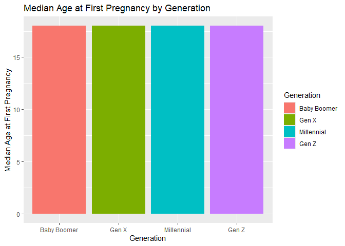
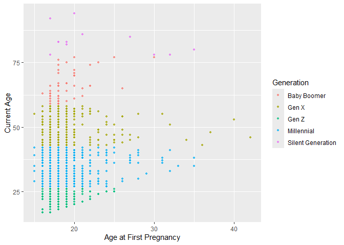
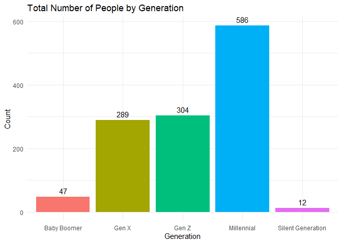
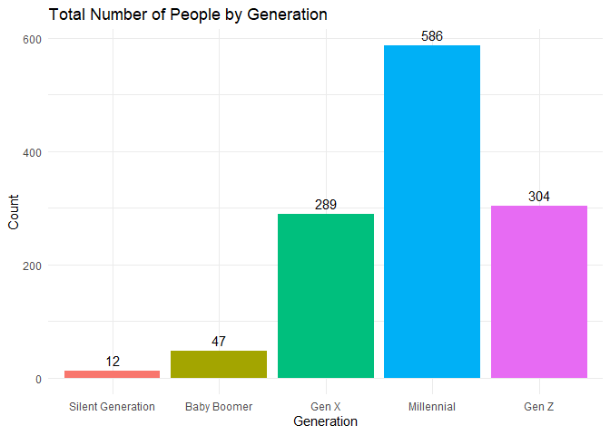
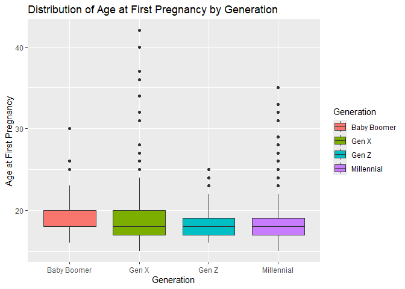

Islands Pregnancy
================
Michaela Fox, Suwanee Li, Lucien Lin
2025-04-28

- [Setup](#setup)
- [Background](#background)
  - [Hypothesis and Null Hypothesis:](#hypothesis-and-null-hypothesis)
  - [Data Collection Methods:](#data-collection-methods)
- [Data Observations](#data-observations)
- [Conclusion](#conclusion)

*Topic:* The topic we chose is the effect of generational differences on
age at first pregnancy. The question we wanted to answer was “How does
an individual’s generation influence the age at which they first become
pregnant in the Islands?” We hypothesized that older people would have
gotten pregnant at a younger age than younger generations.  

# Setup

<!-- ----------------------------------------------------------------------- -->

``` r
library(readr)
library(dplyr)
```

    ## 
    ## Attaching package: 'dplyr'

    ## The following objects are masked from 'package:stats':
    ## 
    ##     filter, lag

    ## The following objects are masked from 'package:base':
    ## 
    ##     intersect, setdiff, setequal, union

``` r
library(stringr)
library(ggplot2)
library(tidyverse)
```

    ## ── Attaching core tidyverse packages ──────────────────────── tidyverse 2.0.0 ──
    ## ✔ forcats   1.0.0     ✔ tibble    3.2.1
    ## ✔ lubridate 1.9.4     ✔ tidyr     1.3.1
    ## ✔ purrr     1.0.2

    ## ── Conflicts ────────────────────────────────────────── tidyverse_conflicts() ──
    ## ✖ dplyr::filter() masks stats::filter()
    ## ✖ dplyr::lag()    masks stats::lag()
    ## ℹ Use the conflicted package (<http://conflicted.r-lib.org/>) to force all conflicts to become errors

``` r
library(rsample)
```

# Background

<!-- ----------------------------------------------------------------------- -->

The Islands is a virtual simulation made by the University of
Queensland. The simulation allows users to interact with people on the
islands, conduct tests on them (as long as you have consent), and
collect data. The people on the Islands contain a record of every aspect
of their lives, including the year the islanders got pregnant. We wanted
to investigate whether generations of islanders different in ages of
first pregnancy, similar to the generations in the real world.

## Hypothesis and Null Hypothesis:

Older islanders got pregnant at a younger age.

Older islanders do not get pregnant at a younger age.

## Data Collection Methods:

We designed a custom web scraper using Python libraries such as
BeautifulSoup and Selenium to collect our data. This scraper was used to
extract information from Arcadia, a village within the Islands
Simulation. Data collection took place on April 27, 2025, and focused on
all currently pregnant individuals living in Arcadia. For each person,
the scraper reliably gathered their name, current address, current age,
the year of their first pregnancy, and their age at first pregnancy.
Individuals were then grouped into generational categories based on age:
12–26 as Gen Z, 27–42 as Millennials, 43–58 as Gen X, and 59–77 as Baby
Boomers. Individuals older than 77 were categorized as the Silent
Generation and were determined to be unimportant to the final results
due to their small sample size. No individuals under the age of 12 were
present in the dataset.

We find our scraper to be reasonably reliable for gathering the desired
data for each individual, including their name, current address, current
age, year of first pregnancy, and age at the time of their first
pregnancy. We designed the data collection procedure using the scraper.


One of the example cases we used to validate our data involved checking
individuals with multiple pregnancies versus those with only one
pregnancy, to ensure the scraper accurately identified the age at which
they became pregnant. For instance, Krishna Lingutla had pregnancies at
ages 17 and 18, and the scraper correctly returned 17 as the age of her
first pregnancy. We also checked individuals who had only one pregnancy,
and the scraper’s data for these cases was consistent with the reported
values.

.jpg)

We double-checked to ensure the age we scraped was accurate, and in most
cases, it was. However, we noticed a limitation with the scraper. Due to
the way the website code was designed, we were only able to capture the
most recent age listed, which sometimes resulted in individuals being
recorded as a year younger than their actual age. Nonetheless, this
discrepancy was only off by one year, which was still within a
reasonable range of their true age.

Some uncertainty factors stem from the nature of the Islands. Since it
is a live simulation, the population is constantly changing. When we
first ran the scraper, there were 1750 houses; this increased to 1800,
and our most recent check shows 1811 houses. This fluctuation affected
our scraper, resulting in only 1650 out of the 1800 houses being scraped
on 4/27/25. However, no data was missing, as the information we scraped
was readily available for everyone. Additionally, we intentionally
excluded individuals from the Silent Generation, as there were only 12
of them in a dataset of over a thousand, and due to their small
population size, we found their data to be unreliable.

We intended to run a full population analysis, but our data collection
was limited by how the information was retrieved from the website. As
mentioned earlier, the number of houses and the population were
constantly changing, which constrained our data collection. However, we
were able to gather data from more than 90% of all the houses.

# Data Observations

<!-- ----------------------------------------------------------------------- -->

``` r
# Load data
#pregnancy_df <- read_csv("C:/Users/mfox/OneDrive - Olin College of Engineering/Data Science/datasciencefinal/Challenge_13/arcadia_pregnancies.csv")

pregnancy_df <- read_csv("C:/Users/llin/Challenge_13/arcadia_pregnancies.csv")
```

    ## Rows: 1238 Columns: 6
    ## ── Column specification ────────────────────────────────────────────────────────
    ## Delimiter: ","
    ## chr (3): Name, Current Address, Pregnancy Details
    ## dbl (3): Current Age, First Pregnancy Year, Age at First Pregnancy
    ## 
    ## ℹ Use `spec()` to retrieve the full column specification for this data.
    ## ℹ Specify the column types or set `show_col_types = FALSE` to quiet this message.

``` r
# View Data
pregnancy_df
```

    ## # A tibble: 1,238 × 6
    ##    Name              `Current Address`      `Current Age` `First Pregnancy Year`
    ##    <chr>             <chr>                          <dbl>                  <dbl>
    ##  1 Krisha Lingutla   Arcadia 1                         51                    330
    ##  2 Claudette Kimura  Arcadia 2                         20                    364
    ##  3 Niamh Morris      Arcadia 3                         40                    343
    ##  4 Shona Young       Arcadia 4                         53                    330
    ##  5 Megumi Endo       Arcadia 5 to be close…            55                    331
    ##  6 Jaye Wilson       Arcadia 8                         25                    356
    ##  7 Rosalind Sorensen Arcadia 9                         20                    364
    ##  8 Renee Blomgren    Arcadia 10                        46                    336
    ##  9 Rina Bhasin       Arcadia 12                        26                    364
    ## 10 Kanoko Nakajima   Arcadia 13                        37                    345
    ## # ℹ 1,228 more rows
    ## # ℹ 2 more variables: `Age at First Pregnancy` <dbl>, `Pregnancy Details` <chr>

``` r
max(pregnancy_df$`Current Age`, na.rm = TRUE)
```

    ## [1] 94

``` r
glimpse(pregnancy_df)
```

    ## Rows: 1,238
    ## Columns: 6
    ## $ Name                     <chr> "Krisha Lingutla", "Claudette Kimura", "Niamh…
    ## $ `Current Address`        <chr> "Arcadia 1", "Arcadia 2", "Arcadia 3", "Arcad…
    ## $ `Current Age`            <dbl> 51, 20, 40, 53, 55, 25, 20, 46, 26, 37, 38, 3…
    ## $ `First Pregnancy Year`   <dbl> 330, 364, 343, 330, 331, 356, 364, 336, 364, …
    ## $ `Age at First Pregnancy` <dbl> 17, 19, 18, 18, 21, 17, 19, 18, 25, 19, 20, 1…
    ## $ `Pregnancy Details`      <chr> "Pregnant", "Pregnant", "Pregnant", "Pregnant…

``` r
summary(pregnancy_df)
```

    ##      Name           Current Address     Current Age    First Pregnancy Year
    ##  Length:1238        Length:1238        Min.   :17.00   Min.   :290.0       
    ##  Class :character   Class :character   1st Qu.:27.00   1st Qu.:338.2       
    ##  Mode  :character   Mode  :character   Median :36.00   Median :347.0       
    ##                                        Mean   :36.73   Mean   :346.3       
    ##                                        3rd Qu.:44.00   3rd Qu.:357.0       
    ##                                        Max.   :94.00   Max.   :365.0       
    ##  Age at First Pregnancy Pregnancy Details 
    ##  Min.   :15.00          Length:1238       
    ##  1st Qu.:17.00          Class :character  
    ##  Median :18.00          Mode  :character  
    ##  Mean   :18.81                            
    ##  3rd Qu.:19.00                            
    ##  Max.   :42.00

``` r
# Get rid of anything that isn't the address
 pregnancy_df <- pregnancy_df %>%
   mutate(
     `Current Address` = str_extract(`Current Address`, "Arcadia\\s*\\d+")
   )
 
 pregnancy_df
```

    ## # A tibble: 1,238 × 6
    ##    Name              `Current Address` `Current Age` `First Pregnancy Year`
    ##    <chr>             <chr>                     <dbl>                  <dbl>
    ##  1 Krisha Lingutla   Arcadia 1                    51                    330
    ##  2 Claudette Kimura  Arcadia 2                    20                    364
    ##  3 Niamh Morris      Arcadia 3                    40                    343
    ##  4 Shona Young       Arcadia 4                    53                    330
    ##  5 Megumi Endo       Arcadia 5                    55                    331
    ##  6 Jaye Wilson       Arcadia 8                    25                    356
    ##  7 Rosalind Sorensen Arcadia 9                    20                    364
    ##  8 Renee Blomgren    Arcadia 10                   46                    336
    ##  9 Rina Bhasin       Arcadia 12                   26                    364
    ## 10 Kanoko Nakajima   Arcadia 13                   37                    345
    ## # ℹ 1,228 more rows
    ## # ℹ 2 more variables: `Age at First Pregnancy` <dbl>, `Pregnancy Details` <chr>

``` r
# Check if Pregnancy details column is all the same information and if it is delete it
pregnancy_df %>%
  distinct(`Pregnancy Details`)
```

    ## # A tibble: 1 × 1
    ##   `Pregnancy Details`
    ##   <chr>              
    ## 1 Pregnant

``` r
pregnancy_df <- pregnancy_df %>%
  filter(Name != "pregnancy details")
```

``` r
pregnancy_df <- pregnancy_df %>%
  mutate(
    Generation = case_when(
      `Current Age` >= 78 ~ "Silent Generation",
      `Current Age` >= 59 ~ "Baby Boomer",
      `Current Age` >= 43 ~ "Gen X",
      `Current Age` >= 27 ~ "Millennial",
      `Current Age` >= 12 ~ "Gen Z",
      TRUE ~ "Other"
    )
  )
```

``` r
# Summarize average age at first pregnancy by generation
pregnancy_df %>%
  filter(Generation != "Silent Generation") %>%
  mutate(Generation = factor(Generation, levels = c("Silent Generation", "Baby Boomer", "Gen X", "Millennial", "Gen Z"))) %>%
  group_by(Generation) %>%
  summarise(
    median_Age_First_Pregnancy = median(`Age at First Pregnancy`, na.rm = TRUE),
    .groups = "drop"
  ) %>%
  ggplot(aes(x = Generation, y = median_Age_First_Pregnancy, fill = Generation)) +
  geom_col() +
  labs(
    title = "Median Age at First Pregnancy by Generation",
    x = "Generation",
    y = "Median Age at First Pregnancy"
  )
```

<!-- -->

**Observations:**

Our first graph, Median Age at First Pregnancy by Generation (Bar Plot),
shows that the median age at first pregnancy is relatively stable across
Gen Z, Millennials, Gen X, and Baby Boomers, hovering around 18 years.
The Silent Generation stands out with a higher median age (~19.5), but
this group was excluded from further analysis due to its small sample
size. This contradicts the initial hypothesis that older generations had
earlier pregnancies. Instead, median ages appear consistent, regardless
of generational group.

``` r
pregnancy_df %>%
  ggplot(aes(x = `Age at First Pregnancy`, y = `Current Age`, color = Generation)) +
  geom_point(alpha = 0.7, size = 1)
```

<!-- -->

**Observations:**

In the graph for Age at First Pregnancy vs. Current Age (Scatter Plot),
the Silent Generation and Baby Boomers cluster in the higher current age
range (60+), with first pregnancies mainly between 16–22. Gen X
individuals are generally aged 45–58, and their first pregnancies also
center around late teens to early twenties. Millennials and Gen Z are
younger (below ~43 and ~26, respectively), with similar early pregnancy
ages. The age at first pregnancy is mostly between 16 and 22 across all
generations, indicating little variation over time in that respect.

``` r
pregnancy_df %>%
  count(Generation) %>%
  ggplot(aes(x = Generation, y = n, fill = Generation)) +
  geom_col() +
  geom_text(aes(label = n), vjust = -0.5) +  # Add count labels
  labs(
    title = "Total Number of People by Generation",
    x = "Generation",
    y = "Count"
  ) +
  theme_minimal() +
  theme(legend.position = "none")
```

<!-- -->

``` r
# Count total number of people by generation in generational order
pregnancy_df %>%
  mutate(Generation = factor(Generation, levels = c("Silent Generation", "Baby Boomer", "Gen X", "Millennial", "Gen Z"))) %>%
  count(Generation) %>%
  ggplot(aes(x = Generation, y = n, fill = Generation)) +
  geom_col() +
  geom_text(aes(label = n), vjust = -0.5) +  # Add count labels
  labs(
    title = "Total Number of People by Generation",
    x = "Generation",
    y = "Count"
  ) +
  theme_minimal() +
  theme(legend.position = "none")
```

<!-- -->

**Observations**

In the third visual, Total Number of People by Generation (Bar Plot) we
noticed Millennials (586) and Gen Z (304) make up the bulk of the data,
followed by Gen X (289). Baby Boomers (47) and Silent Generation (12)
have very small representation. The small sample size for Silent
Generation justifies its exclusion from core analysis. These proportions
reflect a young-skewed population of the Islands, aligning with the
dynamic nature of the simulation.

``` r
# Get rid of silent generation because they make up less than 1% of the population
pregnancy_df <- pregnancy_df %>%
  filter(Generation != "Silent Generation")
```

``` r
pregnancy_df %>%
  mutate(
    Generation = case_when(
      `Current Age` >= 78 ~ "Silent Generation",
      `Current Age` >= 59 ~ "Baby Boomer",
      `Current Age` >= 43 ~ "Gen X",
      `Current Age` >= 27 ~ "Millennial",
      `Current Age` >= 12 ~ "Gen Z",
      TRUE ~ "Other"
    )
  ) %>%
  ggplot(aes(x = Generation, y = `Age at First Pregnancy`, fill = Generation)) +
  geom_boxplot() +
  labs(
    title = "Distribution of Age at First Pregnancy by Generation",
    x = "Generation",
    y = "Age at First Pregnancy"
  )
```

<!-- -->

**Observations** In our last visual, we are comparing the age of
pregnancy against the generations with box plots. When looking at the
median, each generation tends to have the same median pregnancy age.
However, when looking at the upper quartile, the older generations tend
to have a higher pregnancy age.

# Conclusion

<!-- ----------------------------------------------------------------------- -->

Our hypothesis that older generations had earlier pregnancies was not
supported. The islanders’ behavior tended to follow the null hypothesis
instead. Conversely, we observed that the median age at first pregnancy
remained around 18 across Gen Z, Millennials, Gen X, and Baby Boomers.
Scatter plots confirmed that most first pregnancies occurred between
ages 16–22, regardless of generation, and the largest groups in our
dataset were Millennials and Gen Z. Despite minor scraping limitations
and a changing simulation population, our data was reliable and covered
over 90% of households. These findings suggest a stable trend in
pregnancy age across generations and raise new questions about what
cultural, social, or simulation-driven factors contribute to this
consistency.

**Questions for further study:**

- Why has the age at first pregnancy remained stable across generations
  in the Islands simulation?

- Are there simulated policies, cultural factors, or socioeconomic
  conditions driving this trend?
